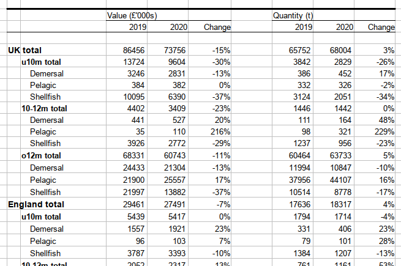
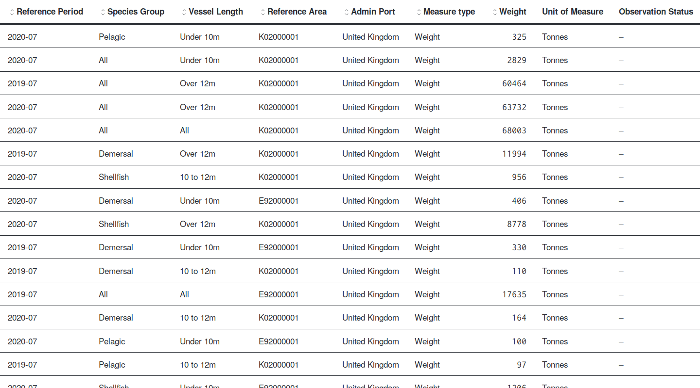

```{r, include = FALSE}
knitr::opts_chunk$set(
  collapse = TRUE,
  comment = "#>"
)
```

This tutorial demonstrates how to tabulate observations from a data cube. We'll convert the one observation per row "tidy" format into a table that looks like the original publication.

Our target is the [UK Sea Fisheries Statistics](https://www.gov.uk/government/collections/ad-hoc-statistical-releases-sea-fisheries-statistics), an adhoc release from the Marine Management Organisation.

The data is provided as a spreadsheet. The first table looks like this:

```{r upstream-table, fig.align = 'center', out.width = "80%", fig.cap = "Fisheries Statistics as they in the upstream release", echo=F}

```

This is a cross-tabulation with row grouping and stacked column headers. The rows show three variables, with fishing activity grouped by Country, Vessel Length, and Species Group. The columns distinguish two measures - quantity and value, within this we have columns for years and a calculation of the change between 2019 and 2020.

This [dataset is available as a DataCube](https://staging.gss-data.org.uk/cube/explore?uri=http%3A%2F%2Fgss-data.org.uk%2Fdata%2Fgss_data%2Fcovid-19%2Fmmo-ad-hoc-statistical-release-uk-sea-fisheries-statistics-catalog-entry) on the COGS website. Here's a screenshot:

```{r cogs-table, fig.align = 'center', out.width = "80%", fig.cap = "Fisheries Statistics as they appear on COGS", echo=F}

```

We can extract this into a linked-data frame.

```{r setup, message=FALSE}
library(ldf)
library(dplyr)
library(knitr)
```

```{r eval=FALSE}
fish <- get_cube("http://gss-data.org.uk/data/gss_data/covid-19/mmo-ad-hoc-statistical-release-uk-sea-fisheries-statistics#dataset")
```

```{r echo=FALSE, message=FALSE, warning=FALSE}
suppressPackageStartupMessages(require(vcr, quietly = TRUE))
invisible(vcr::use_cassette("tabulate-datacube", {
  fish <- get_cube("http://gss-data.org.uk/data/gss_data/covid-19/mmo-ad-hoc-statistical-release-uk-sea-fisheries-statistics#dataset")
}))
```

This data frame looks like this (peeking at the first 10 rows):

```{r message=FALSE}
library(kableExtra)

peak <- function(df) {
  df %>% head() %>%  kbl()
}

peak(fish)
```

We can recreate the cross-tabulation as follows:

```{r crosstab}
library(tidyr)

fish_table <- fish %>% 
  filter(label(admin_port)=="United Kingdom") %>%
  pivot_wider(id_cols=c(reference_area, vessel_length, species_group),
              names_from=c(measure_type, reference_period),
              names_glue="{label(measure_type)}_{label(reference_period)}",
              values_from=weight) %>%
  arrange(reference_area, vessel_length, species_group) %>%
  mutate(change=(`Weight_2020-07`/`Weight_2019-07`)-1)
```

The first 10 rows of which look like:
```{r}
peak(fish_table)
```

We can produce something formatted like the original as follows:
```{r presentational-table}
library(scales)

fish_table %>% 
  mutate(change=percent(change)) %>%
  rename("Area"=reference_area, "Vessel Length"=vessel_length, "Species Group"=species_group,
         "2019-07"=`Weight_2019-07`, "2020-07"=`Weight_2020-07`, "Change"=change) %>%
  kbl(caption="Activity of the UK fishing fleet by country, vessel length and species group", escape=F) %>%
  kable_classic(full_width = F) %>%
  column_spec(6, extra_css = "text-align: right") %>%
  add_header_above(c(" "=3,"Quantity (t)"=3)) %>%
  collapse_rows(columns = 1:3, valign = "top")
```
